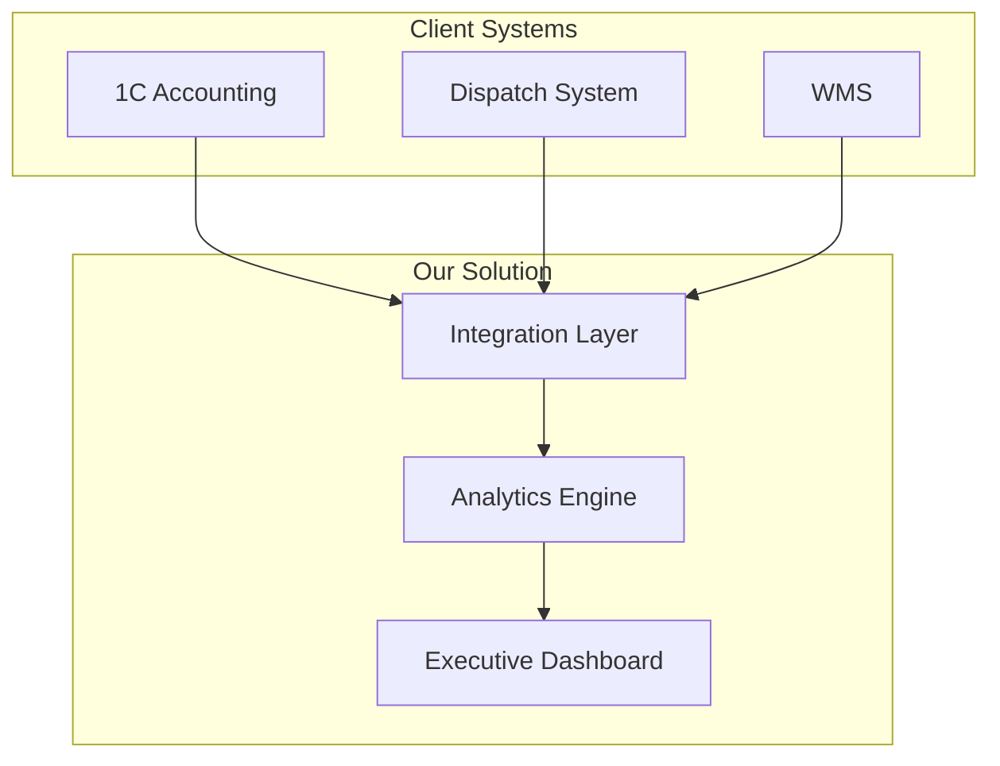
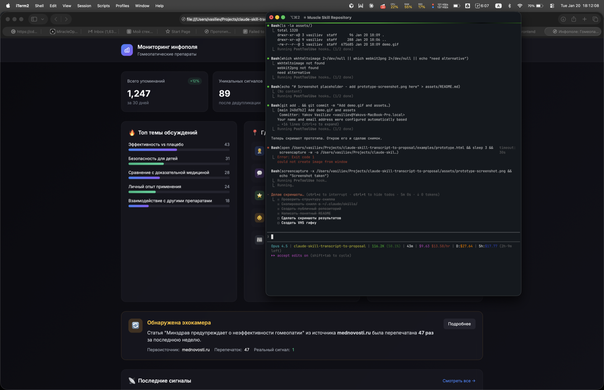

# Transcript to Proposal

A Claude Code skill that transforms client call transcripts into professional commercial proposals with architecture diagrams and interactive prototypes.


## What it does

You give Claude two things:
1. **Your product description** — what you sell, features, integrations
2. **A transcript** — recording of a client conversation

Claude gives you back three files:
- `proposal.md` — commercial proposal using client's own words
- `architecture.md` — technical architecture with Mermaid diagrams
- `prototype.html` — clickable prototype showing the solution

## How it works

```
┌─────────────────────────────────────────────────────────────┐
│  INPUT                                                       │
│  📦 Product description + 🎙️ Client transcript              │
└─────────────────────────────────────────────────────────────┘
                              ↓
┌─────────────────────────────────────────────────────────────┐
│  STEP 1: Extract & classify pains                           │
│                                                              │
│  🔴 Trigger events (buying now)                             │
│  🟡 Active problems (looking for solution)                  │
│  🟢 Latent issues (aware but passive)                       │
│                                                              │
│  ◆ CHECKPOINT: Confirm priorities with user                 │
└─────────────────────────────────────────────────────────────┘
                              ↓
┌─────────────────────────────────────────────────────────────┐
│  STEP 2: Map solutions                                       │
│                                                              │
│  Pain → Product feature → How it solves → Proof             │
│                                                              │
│  ◆ CHECKPOINT: Confirm architecture with user               │
└─────────────────────────────────────────────────────────────┘
                              ↓
┌─────────────────────────────────────────────────────────────┐
│  STEP 3: Generate proposal                                   │
│                                                              │
│  Using CLIENT'S words from transcript                        │
│  Every claim traces back to pain → feature → result         │
└─────────────────────────────────────────────────────────────┘
                              ↓
┌─────────────────────────────────────────────────────────────┐
│  STEP 4: Build prototype                                     │
│                                                              │
│  Interactive HTML showing the MAIN pain solved              │
│  Real data from client context                               │
└─────────────────────────────────────────────────────────────┘
                              ↓
┌─────────────────────────────────────────────────────────────┐
│  OUTPUT                                                      │
│  📄 proposal.md  📐 architecture.md  🖥️ prototype.html     │
└─────────────────────────────────────────────────────────────┘
```

## Installation

Copy `SKILL.md` to your Claude Code skills directory:

```bash
cp SKILL.md ~/.claude/skills/transcript-to-proposal/SKILL.md
```

Or create the directory first:

```bash
mkdir -p ~/.claude/skills/transcript-to-proposal
cp SKILL.md ~/.claude/skills/transcript-to-proposal/
```

## Usage

In Claude Code, invoke the skill:

```
/transcript-to-proposal
```

Or just mention what you need:

```
I have a transcript from a client call. Help me create a proposal.
```

Claude will ask for:
1. Your product description (paste or attach file)
2. The transcript (paste or attach file)

Then it walks you through the process with checkpoints.

## Example Output

### Proposal excerpt

> **Understanding the Situation**
>
> You're facing a classic data silo problem: "each department lives in their own Excel spreadsheet, and nobody sees the full picture." When leadership asks about route efficiency, it takes "two weeks to collect data from different systems." By then, competitors have already moved.

### Architecture diagram



### Prototype screenshot



## Key Features

**Pain Classification Framework**
- **Level**: Strategic / Tactical / Operational
- **Urgency**: Trigger event / Active / Latent
- **Speaker**: Decision maker / Influencer / User

**Trigger Event Detection**
- "Management is asking..."
- "By end of quarter..."
- "We already tried X, didn't work..."
- External deadlines, compliance requirements

**Human-in-the-Loop**
- Checkpoint after pain analysis
- Checkpoint after architecture
- User confirms before each major step

## Why This Works

1. **Uses client's words** — proposals feel personal, not generic
2. **Traces every claim** — pain → feature → result chain
3. **Prioritizes trigger events** — focuses on what makes them buy NOW
4. **Shows, doesn't tell** — prototype demonstrates the solution

## License

MIT

## Credits

Built with [Claude Code](https://claude.ai/code) skills system.
