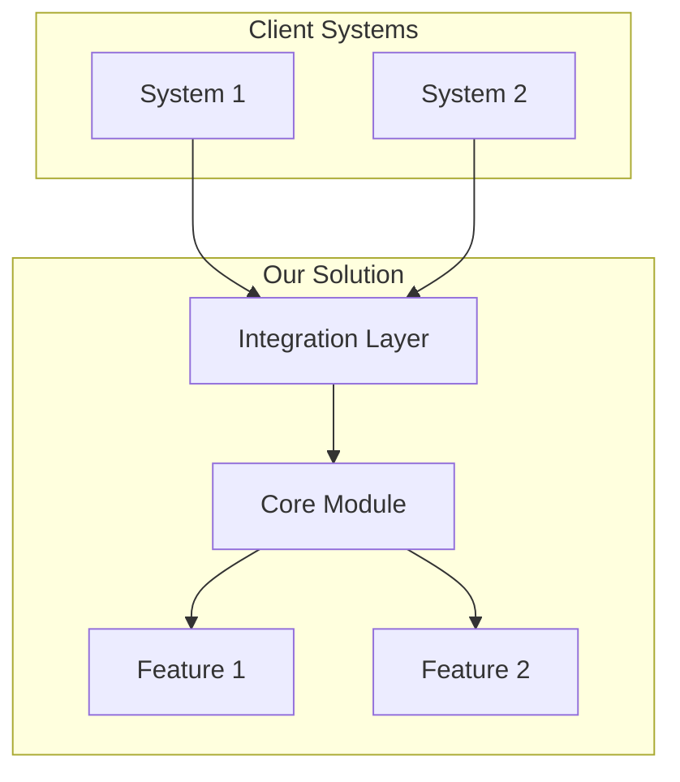

# Transcript to Proposal

Transforms a client call transcript into a commercial proposal with architecture documentation and a clickable prototype.

---

## Step 0: Gather Input Documents

**Two documents are required:**

1. **Product Description** — what you're selling, capabilities, integrations
2. **Call Transcript** — recording of the conversation with the client

**Action:** If the user hasn't provided both documents, request the missing one:

```
To create a proposal, I need two documents:

1. Product description (markdown) — what you sell, features, integrations
2. Client call transcript

Please attach files or paste the text.
```

**Do not proceed to the next step until you have both documents.**

---

## Step 1: Client Pain Analysis

Read the transcript and extract ALL client pains.

### Classification Framework

| Dimension | Options |
|-----------|---------|
| **Level** | Strategic (business) / Tactical (process) / Operational (daily problems) |
| **Urgency** | Trigger (buying now) / Active (looking for solution) / Latent (aware but passive) |
| **Speaker Role** | Decision Maker / Influencer / User |

### Trigger Event Markers (Highest Priority)

Look for phrases like:
- "management is asking...", "by end of quarter..."
- "we already tried X, didn't work..."
- "audit showed...", "regulators require..."
- Any external deadlines, pressure from above

### Output Format

```markdown
## Client Pains

### 1. [Pain Name]
- **Quote:** "[exact quote from transcript]"
- **Level:** Strategic | Tactical | Operational
- **Urgency:** Trigger | Active | Latent
- **Who said it:** [role]
```

---

## CHECKPOINT 1: Pain Confirmation

**Show the user the analysis results:**

```
Found N pains in the transcript:

TRIGGER (main proposal focus):
   - [pain] — "[quote]"

Active problems:
   - [pain] — "[quote]"

Latent:
   - [pain]

Questions:
1. Did I prioritize correctly?
2. Did I miss anything?
3. Is there context I'm not seeing in the transcript?
```

**Wait for user response. Do not continue without confirmation.**

---

## Step 2: Product Mapping

For each confirmed pain, find in the product description:

1. **Which feature solves** this pain
2. **How exactly it solves it** (mechanism)
3. **Proof** (case study from description or logical reasoning)

### Format

```markdown
## Solution Map

| Client Pain | Product Feature | How It Solves | Proof |
|-------------|-----------------|---------------|-------|
| [pain 1] | [feature] | [mechanism] | [case/logic] |
| [pain 2] | [feature] | [mechanism] | [case/logic] |
```

### Solution Architecture

Based on the solution map, create a system diagram:



---

## CHECKPOINT 2: Architecture Confirmation

**Show the user:**

```
Proposing this architecture:

[Mermaid diagram]

Key decisions:
1. [Decision] — because client said "[quote]"
2. [Decision] — because product has [feature]

Questions:
1. Is the architecture clear?
2. Any constraints (budget, tech stack, timeline)?
3. Need to change scope?
```

**Wait for user response. Do not continue without confirmation.**

---

## Step 3: Commercial Proposal Generation

Create file `proposal.md`:

```markdown
# Commercial Proposal for [Client Name]

## Executive Summary

- **Problem:** [main trigger pain in client's words]
- **Solution:** [what we propose, one sentence]
- **Result:** [specific outcome]

## Understanding Your Situation

[Rephrase client pains using THEIR words from the transcript]

[Show you understand context: why now, what they tried, what didn't work]

## Proposed Solution

[Architecture — insert Mermaid diagram]

### Solution Components

**[Component 1]**
- What it does: [description]
- Solves pain: "[pain quote]"

**[Component 2]**
- What it does: [description]
- Solves pain: "[pain quote]"

## Implementation Phases

### Phase 1: [Quick win — solving trigger pain]
- What we do: [specifics]
- Result: [what client gets]

### Phase 2: [Core functionality]
- What we do: [specifics]
- Result: [what client gets]

### Phase 3: [Expansion]
- What we do: [specifics]
- Result: [what client gets]

## Expected Outcomes

| Pain | Current State | Expected State |
|------|---------------|----------------|
| [pain 1] | [current] | [expected] |

## Next Steps

1. [Specific action]
2. [Specific action]
```

### Writing Rules

- **Use client's words** — copy phrases from transcript
- **Every claim is traceable** — pain → feature → outcome
- **No marketing BS** — only specifics
- **What's included, what's not** — explicitly state boundaries

---

## Step 4: Prototype Creation

Create an interactive HTML prototype demonstrating the solution to the MAIN pain (trigger event).

### Prototype Scope

- **1-2 screens maximum**
- **Focus on trigger pain** — show exactly how it's solved
- **Realistic data** — use context from the transcript

### Technical Requirements

- Single HTML file with embedded CSS/JS
- Tailwind CSS via CDN
- Dark theme, modern design
- Responsive layout
- Interactive elements (but no backend)

### What the Prototype Must Include

1. **Header** with client name (as if it's their system)
2. **Main screen** — solving the trigger pain
3. **Data** — relevant to client context (names, metrics, regions from transcript)
4. **Navigation** — hint at other capabilities

---

## Final Output

Create three files in the current directory:

1. **`proposal.md`** — commercial proposal
2. **`architecture.md`** — technical architecture with Mermaid diagrams
3. **`prototype.html`** — clickable prototype

**After creating files:**

```
Done! Created three files:

proposal.md — commercial proposal
architecture.md — solution architecture
prototype.html — interactive prototype

Open the prototype in browser?
```
