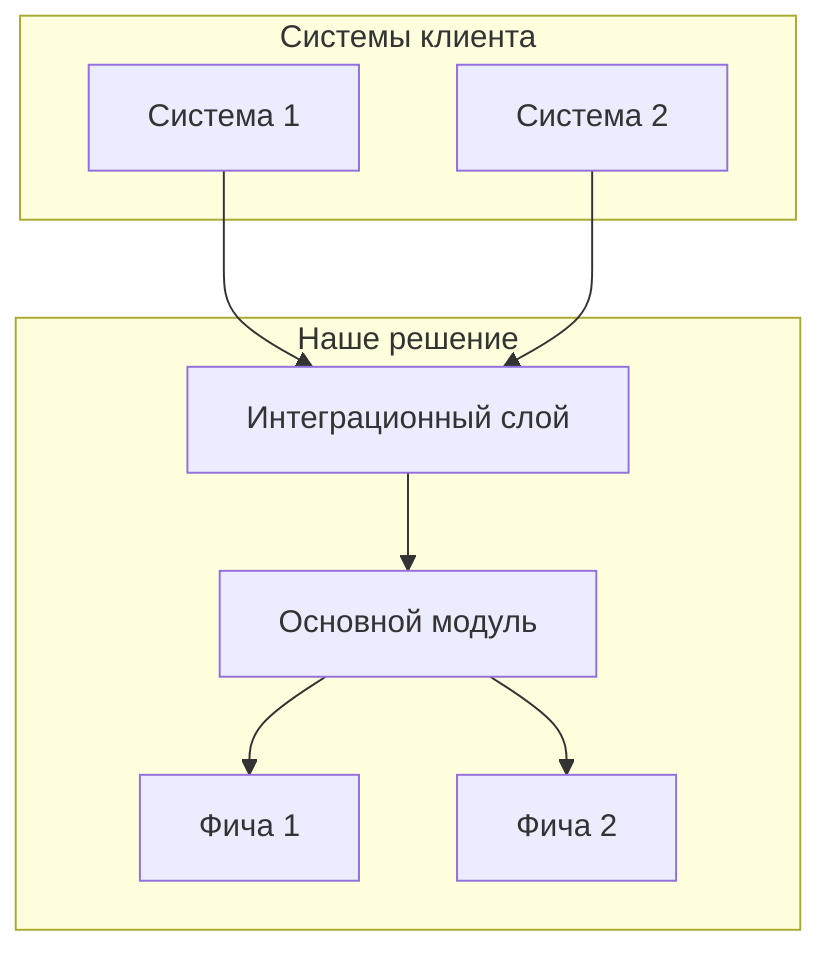

# Transcript to Proposal

Превращает транскрипт звонка с клиентом в коммерческое предложение с архитектурой и кликабельным прототипом.

---

## Шаг 0: Получить входные данные

**Требуется два документа:**

1. **Описание продукта** — что продаёшь, какие возможности, с чем интегрируется
2. **Транскрипт беседы** — запись разговора с клиентом

**Действие:** Если пользователь не приложил оба документа, запроси недостающее:

```
Для создания КП мне нужны два документа:

1. 📦 Описание продукта (markdown) — что продаёте, возможности, интеграции
2. 🎙️ Транскрипт беседы с клиентом

Приложи файлы или вставь текст.
```

**Не переходи к следующему шагу, пока не получишь оба документа.**

---

## Шаг 1: Анализ болей клиента

Прочитай транскрипт и извлеки ВСЕ боли клиента.

### Классификация каждой боли

| Измерение | Варианты |
|-----------|----------|
| **Уровень** | Стратегический (бизнес) / Тактический (процессы) / Операционный (ежедневные проблемы) |
| **Срочность** | 🔴 Триггер (покупают сейчас) / 🟡 Активная (ищут решение) / 🟢 Латентная (знают, но пассивны) |
| **Роль говорящего** | ЛПР / Влиятель / Пользователь |

### Маркеры триггер-события (высший приоритет)

Ищи фразы:
- "руководство спрашивает...", "до конца квартала..."
- "мы уже пробовали X, не работает..."
- "аудит показал...", "регулятор требует..."
- Любые внешние дедлайны, давление сверху

### Формат вывода

```markdown
## Боли клиента

### 1. [Название боли]
- **Цитата:** "[точная цитата из транскрипта]"
- **Уровень:** Стратегический | Тактический | Операционный
- **Срочность:** 🔴 Триггер | 🟡 Активная | 🟢 Латентная
- **Кто сказал:** [роль]
```

---

## ◆ ЧЕКПОЙНТ 1: Подтверждение болей

**Покажи пользователю результат анализа:**

```
Нашёл N болей в транскрипте:

🔴 ТРИГГЕР (главный фокус КП):
   • [боль] — "[цитата]"

🟡 Активные проблемы:
   • [боль] — "[цитата]"

🟢 Латентные:
   • [боль]

Вопросы:
1. Правильно расставил приоритеты?
2. Что-то упустил?
3. Есть контекст, который я не вижу в транскрипте?
```

**Жди ответа пользователя. Не продолжай без подтверждения.**

---

## Шаг 2: Сопоставление с продуктом

Для каждой подтверждённой боли найди в описании продукта:

1. **Какая фича решает** эту боль
2. **Как именно решает** (механизм)
3. **Доказательство** (кейс из описания или логическое обоснование)

### Формат

```markdown
## Карта решений

| Боль клиента | Фича продукта | Как решает | Доказательство |
|--------------|---------------|------------|----------------|
| [боль 1] | [фича] | [механизм] | [кейс/логика] |
| [боль 2] | [фича] | [механизм] | [кейс/логика] |
```

### Архитектура решения

На основе карты решений создай схему системы:



---

## ◆ ЧЕКПОЙНТ 2: Подтверждение архитектуры

**Покажи пользователю:**

```
Предлагаю такую архитектуру:

[Mermaid-диаграмма]

Ключевые решения:
1. [Решение] — потому что клиент сказал "[цитата]"
2. [Решение] — потому что в продукте есть [фича]

Вопросы:
1. Архитектура понятна?
2. Есть ограничения (бюджет, стек, сроки)?
3. Нужно изменить scope?
```

**Жди ответа пользователя. Не продолжай без подтверждения.**

---

## Шаг 3: Генерация коммерческого предложения

Создай файл `proposal.md`:

```markdown
# Коммерческое предложение для [Название клиента]

## Резюме

• **Проблема:** [главная боль-триггер словами клиента]
• **Решение:** [что предлагаем, одно предложение]
• **Результат:** [конкретный outcome]

## Понимание ситуации

[Перефразируй боли клиента, используя ЕГО слова из транскрипта]

[Покажи, что понимаешь контекст: почему сейчас, что пробовали, что не сработало]

## Предлагаемое решение

[Архитектура — вставь Mermaid-диаграмму]

### Компоненты решения

**[Компонент 1]**
- Что делает: [описание]
- Решает боль: "[цитата боли]"

**[Компонент 2]**
- Что делает: [описание]
- Решает боль: "[цитата боли]"

## Этапы внедрения

### Этап 1: [Quick win — решение триггер-боли]
- Что делаем: [конкретика]
- Результат: [что получит клиент]

### Этап 2: [Основной функционал]
- Что делаем: [конкретика]
- Результат: [что получит клиент]

### Этап 3: [Расширение]
- Что делаем: [конкретика]
- Результат: [что получит клиент]

## Ожидаемые результаты

| Боль | Метрика до | Метрика после |
|------|------------|---------------|
| [боль 1] | [текущее состояние] | [ожидаемое] |

## Следующие шаги

1. [Конкретное действие]
2. [Конкретное действие]
```

### Правила написания

- **Используй слова клиента** — копируй фразы из транскрипта
- **Каждое утверждение прослеживается** — боль → фича → результат
- **Никакого маркетингового буллшита** — только конкретика
- **Что входит, что не входит** — явно указывай границы

---

## Шаг 4: Создание прототипа

Создай интерактивный HTML-прототип, демонстрирующий решение ГЛАВНОЙ боли (триггер-события).

### Scope прототипа

- **1-2 экрана максимум**
- **Фокус на триггер-боли** — покажи, как именно она решается
- **Реалистичные данные** — используй контекст из транскрипта

### Технические требования

- Один HTML-файл со встроенными CSS/JS
- Tailwind CSS через CDN
- Тёмная тема, современный дизайн
- Адаптивная вёрстка
- Интерактивные элементы (но без backend)

### Что должно быть в прототипе

1. **Header** с названием клиента (как будто это их система)
2. **Главный экран** — решение триггер-боли
3. **Данные** — релевантные контексту клиента (названия, метрики, регионы из транскрипта)
4. **Навигация** — намёк на остальные возможности

---

## Финальный вывод

Создай три файла в текущей директории:

1. **`proposal.md`** — коммерческое предложение
2. **`architecture.md`** — техническая архитектура с Mermaid-диаграммами
3. **`prototype.html`** — кликабельный прототип

**После создания файлов:**

```
Готово! Создал три файла:

📄 proposal.md — коммерческое предложение
📐 architecture.md — архитектура решения
🖥️ prototype.html — интерактивный прототип

Открыть прототип в браузере?
```
