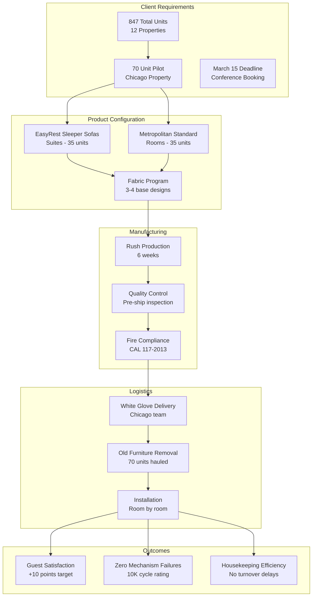
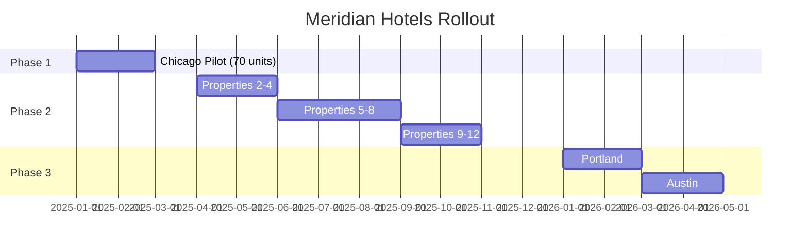

# Solution Architecture: Meridian Hotels Furniture Program

## Overview



---

## Components

### 1. EasyRest Sleeper System

**Purpose:** Solve the core pain of mechanism failures and guest discomfort

**Technical Specifications:**
| Feature | Specification |
|---------|--------------|
| Mechanism Type | External fold-out (no internal storage) |
| Cycle Rating | 10,000+ operations |
| Mattress | 6" memory foam, stored separately |
| Frame | Hardwood with reinforced joints |
| Warranty | Lifetime on frame, 5 years on mechanism |

**Solves Pain:** "The mechanisms are failing constantly" / "The mattress is thin, guests complain"

**How It Works:**
```
Traditional Sleeper:
┌─────────────────────────────┐
│  Sofa frame                 │
│  ┌─────────────────────┐    │
│  │ Folded mattress     │    │  ← Thin, compressed, uncomfortable
│  │ Springs & mechanism │    │  ← Complex, prone to jamming
│  └─────────────────────┘    │
└─────────────────────────────┘

EasyRest System:
┌─────────────────────────────┐
│  Sofa frame                 │
│  ┌─────────────────────┐    │
│  │ Simple platform     │    │  ← No moving parts to jam
│  │ Fold-out support    │    │  ← 10K+ cycle rating
│  └─────────────────────┘    │
└─────────────────────────────┘
        +
┌─────────────────────────────┐
│  Separate 6" mattress       │  ← Full comfort, closet-stored
└─────────────────────────────┘
```

---

### 2. Fabric Program

**Purpose:** Balance customization with operational simplicity

**Configuration:**
- 3-4 base silhouettes (transitional design, David's preference)
- Earth tones for mountain properties
- Cool blues for coastal properties
- All commercial-grade: 100,000+ double rubs

**Compliance:**
| Standard | Requirement | Our Rating |
|----------|-------------|------------|
| CAL 117-2013 | Fire safety | Compliant |
| Wyzenbeek | Abrasion resistance | 100,000+ |
| Commercial cleaning | Chemical resistance | Tested & approved |

**Solves Pain:** "Whatever fabric you use needs to handle commercial cleaning" / "Fire rating... inspector flagged all the lobby furniture"

---

### 3. Logistics & Installation

**Purpose:** End-to-end delivery with zero client burden

**Process Flow:**
```
Week 7: Delivery Coordination
├── Contact facilities team
├── Confirm delivery windows
└── Stage removal logistics

Week 8: Installation
├── Day 1-2: Deliver new sofas (floors 1-4)
├── Day 3-4: Deliver new sofas (floors 5-8)
├── Day 5: Remove old sofas (all floors)
├── Day 6: Final inspection
└── Day 7: Walkthrough with Sarah & David
```

**Included Services:**
- White glove delivery (in-house Chicago team)
- Old furniture removal and recycling
- Room-by-room installation
- Final quality inspection
- Single point of contact throughout

**Solves Pain:** "Can you handle the old sofa removal? We don't have storage space"

---

## Implementation Timeline

```
JANUARY                    FEBRUARY                   MARCH
Week 1   Week 2   Week 3   Week 4   Week 5   Week 6   Week 7   Week 8
┌────────┬────────┬────────┬────────┬────────┬────────┬────────┬────────┐
│ DESIGN │ DESIGN │ PRODUCTION                        │DELIVERY│INSTALL │
│        │        │                                   │        │        │
│ On-site│ Fabric │ Rush manufacturing                │ Ship   │ Install│
│ visit  │ select │ Quality inspection                │ to CHI │ + QA   │
└────────┴────────┴────────┴────────┴────────┴────────┴────────┴────────┘
                                                               ↓
                                                        MARCH 15
                                                     Conference Ready
```

---

## Phased Rollout Architecture

### Phase 1: Chicago Pilot (Current Scope)
- 70 units
- Single property
- Proves concept before full commitment

### Phase 2: Full Fleet (Post-Pilot)
- 777 remaining units
- 11 properties
- 6-8 month phased delivery
- Volume pricing applies (15% at 100+ units)

### Phase 3: New Properties (2026)
- Portland: ~90 units
- Austin: ~90 units
- Preferred partner pricing



---

## Risk Mitigation

| Risk | Mitigation |
|------|------------|
| Production delays | Rush premium paid, dedicated production line |
| Fabric availability | Using in-stock commercial fabrics only |
| Delivery issues | In-house Chicago team, not third-party |
| Quality problems | Pre-ship inspection, room-by-room QA on install |
| Payment terms | 30/70 split approved based on partnership potential |

---

## What's Not Included

1. **Lobby furniture** — guest rooms only in this scope
2. **Leather options** — performance fabrics only
3. **Properties outside Chicago** — quoted separately after pilot
4. **Custom COM fabrics** — would add 4+ weeks to timeline
