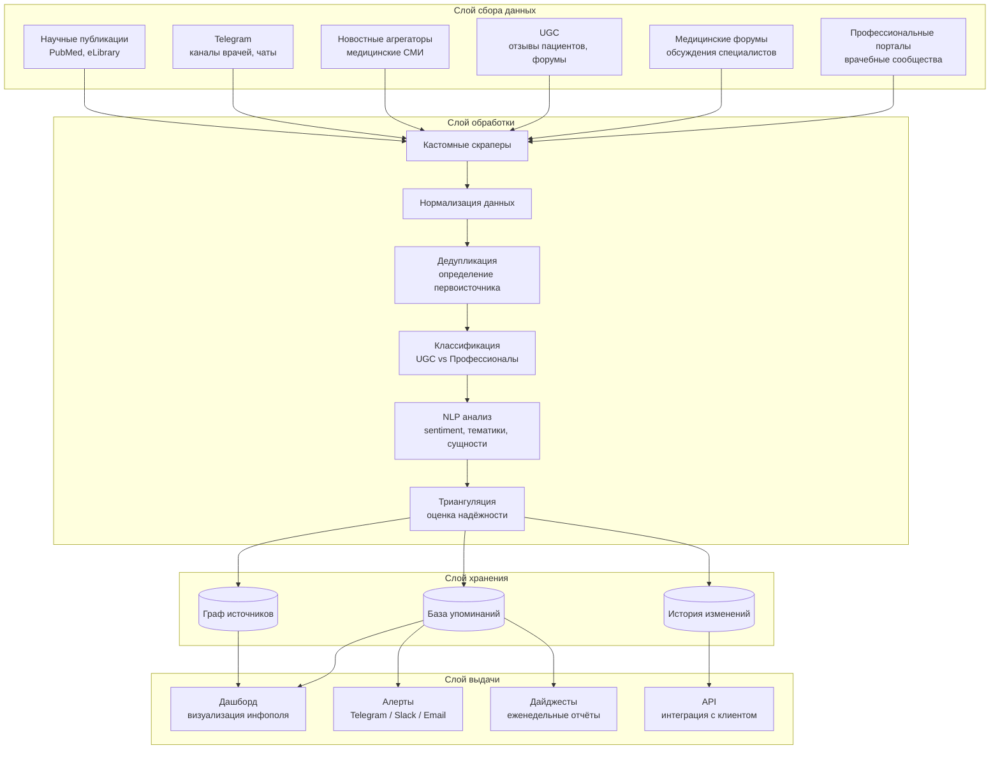

# Архитектура решения: Мониторинг инфополя для фармы

## Обзор



---

## Компоненты

### 1. Кастомные скраперы

**Назначение:** Сбор данных из всех релевантных источников в рунете

**Типы источников для фармы:**
| Тип | Примеры | Сложность |
|-----|---------|-----------|
| Профессиональные порталы | Врачи.рф, Доктор на работе, профильные сообщества | Средняя |
| Форумы врачей | Закрытые и открытые обсуждения | Средняя |
| UGC | Отзовик, IRecommend, форумы пациентов | Низкая |
| Новости | Медицинские СМИ, агрегаторы | Низкая |
| Telegram | Каналы и чаты врачей | Средняя |
| Маркетплейсы | Аптека.ру, Еаптека — отзывы | Низкая |

**Решает боль:** "не всегда маркетологи понимают где профессиональное сообщество читает и публикует"

---

### 2. Дедупликация эхокамер

**Назначение:** Определение первоисточника, отсечение перепечаток

**Алгоритм:**
```
1. Для каждого сигнала определяем:
   - Время первой публикации
   - Источник первой публикации
   - Цепочку распространения

2. Строим граф распространения:
   Первоисточник → Перепечатка 1 → Перепечатка 2 → ...

3. Присваиваем веса:
   - Первоисточник: вес 1.0
   - Перепечатки: вес 0.1 (учитываем только охват)

4. Считаем реальный reach vs кажущийся
```

**Выход:**
- Реальное количество уникальных сигналов
- Характеристика источника (насколько хорошо расходится)
- Флаг "эхокамера" для перепечаток

**Решает боль:** "кажется что присутствия много, а на самом деле сигнал один"

---

### 3. Классификация: UGC vs Профессионалы

**Назначение:** Разделение мнений пациентов и мнений врачей

**Признаки классификации:**

| Признак | UGC (пациенты) | Профессионалы |
|---------|----------------|---------------|
| Вокабуляр | Бытовой, эмоциональный | Терминология, нейтральный |
| Источник | Отзовики, форумы пациентов | Профессиональные порталы |
| Контекст | "Мне помогло / не помогло" | "Клинические данные показывают" |
| Структура | Нарратив, история | Аргументация, ссылки |

**Выход:**
- Тег: UGC / Professional / Mixed
- Confidence score
- Ключевые маркеры

**Решает боль:** "авторитетные источники говорят одно, UGC говорит другое — сразу actionable insights"

---

### 4. Триангуляция и оценка надёжности

**Назначение:** Присвоение каждому сигналу коэффициента надёжности

**Факторы:**
- Авторитетность источника (PageRank-подобная метрика)
- Количество независимых подтверждений
- Тип источника (UGC vs Professional)
- Свежесть данных

**Выход:**
- Reliability score (0-100)
- Флаги: "требует проверки", "высокая достоверность"

**Решает боль:** "нужно давать для какого-то сигнала свой коэффициент"

---

### 5. Дашборд инфополя

**Назначение:** Визуализация для клиента — "что происходит в сети"

**Секции дашборда:**

```
┌─────────────────────────────────────────────────────────┐
│  ИНФОПОЛЕ: [Действующее вещество / Препарат]            │
│  Период: последние 30 дней                              │
├─────────────────────────────────────────────────────────┤
│                                                         │
│  📊 ОБЩАЯ КАРТИНА                                       │
│  • Всего упоминаний: 1,247                              │
│  • Уникальных сигналов: 89 (после дедупликации)        │
│  • UGC: 67% | Профессионалы: 33%                       │
│                                                         │
├─────────────────────────────────────────────────────────┤
│                                                         │
│  🔥 ТОП ТЕМЫ                                            │
│  1. Эффективность vs плацебо (43 упоминания)           │
│  2. Побочные эффекты (28 упоминаний)                   │
│  3. Сравнение с аналогами (19 упоминаний)              │
│                                                         │
├─────────────────────────────────────────────────────────┤
│                                                         │
│  📍 ГДЕ ОБСУЖДАЮТ                                       │
│  • Форум врачей X: 34%                                  │
│  • Telegram-канал Y: 23%                                │
│  • Отзовик Z: 21%                                       │
│  • Прочие: 22%                                          │
│                                                         │
├─────────────────────────────────────────────────────────┤
│                                                         │
│  ⚡ РАЗНИЦА МНЕНИЙ                                      │
│                                                         │
│  Профессионалы:          UGC:                          │
│  "Доказательная база     "Мне помогло, принимаю        │
│  слабая, но безвредно"   уже 3 года"                   │
│                                                         │
│  Sentiment: 😐 Нейтрально  Sentiment: 😊 Позитивно      │
│                                                         │
└─────────────────────────────────────────────────────────┘
```

---

## План развёртывания

### Неделя 1: Discovery + Source Mapping
- Получаем вводные от клиента (Аня → гомеопаты)
- Составляем карту источников
- Оцениваем сложность и объём

### Неделя 2: Сбор данных + Первичная обработка
- Разворачиваем скраперы
- Собираем исторические данные (3-6 месяцев)
- Первичная дедупликация

### Неделя 3: Анализ + Демо
- Классификация UGC vs Профессионалы
- Построение дашборда
- Демонстрация клиенту

---

## Ограничения текущей версии

1. **Не включено:** Парсинг аптечных сетей (остатки, представленность) — требует отдельной оценки
2. **Не включено:** Анализ разговоров медпредов — отдельное направление
3. **Не включено:** Корреляция с выпиской препаратов — нужны данные продаж
