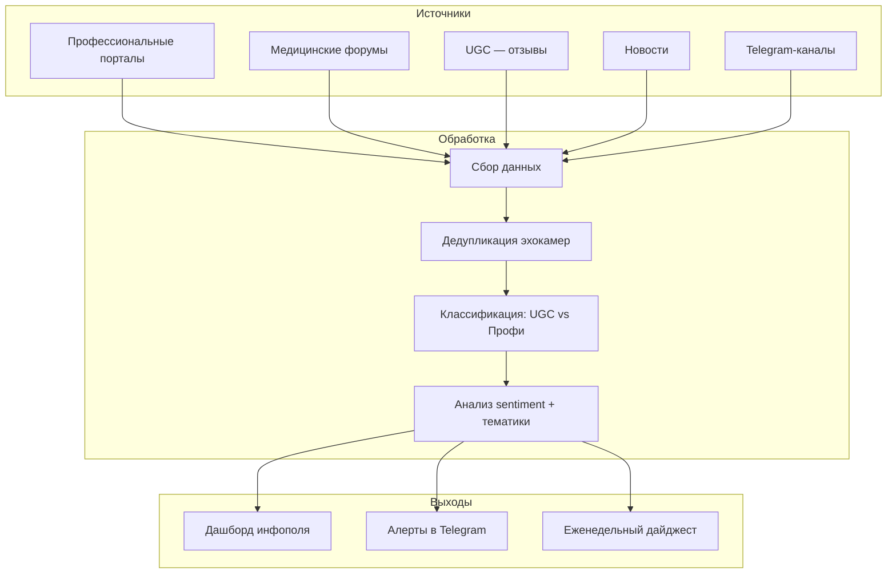

# Коммерческое предложение для Алексея и команды

## Резюме

• **Проблема:** Фарма не верит в digital-коммуникацию с врачами, потому что нет инструмента, который покажет реальную картину инфополя — где обсуждают, кто обсуждает, что говорят.

• **Решение:** Демо-проект на примере гомеопатов — за 2-3 недели собираем данные, показываем разницу между UGC и профессиональным сообществом, убираем эхокамеры.

• **Результат:** Готовый аргумент для фармы: "Вот где реально идёт дискуссия, вот что говорят, вот куда имеет смысл вкладываться — а не в порталы, куда приходят три с половиной коллеги".

---

## Понимание ситуации

Вы работаете с фарм-компаниями и видите одну и ту же проблему:

**Маркетологи фармы не понимают, где профессиональное сообщество читает, публикует и комментирует контент.** Они вкладывают деньги в собственные порталы, куда "приходят три с половиной коллеги, и это в большинстве случаев сотрудники".

При этом **нет инструмента, который бы доказал, что digital-коммуникация с врачами реально влияет на выписку**. Цифровая коммуникация "достаточно сильно подвергается критике с точки зрения эффективности".

Чтобы сломать эту картину мира, нужно **показать от обратного**: вот как сейчас выглядит инфополе без вашего вмешательства, вот где реально тусуется профессиональное сообщество, вот на что можно влиять.

**Дополнительная сложность:** много эхокамер. "Один и тот же источник везде перепечатали, и кажется, что присутствия много, а на самом деле сигнал один." Нужна триангуляция.

Вам нужна демка — быстро, понятно, чтобы можно было показать клиенту и понять: "можно ли это продавать".

---

## Предлагаемое решение

### Архитектура

### Компоненты решения

**Кастомные скраперы**
- Что делает: собирает данные из всех релевантных источников — порталы врачей, форумы, UGC, новости, Telegram
- Решает боль: "не всегда маркетологи понимают где профессиональное сообщество"

**Дедупликация эхокамер**
- Что делает: определяет первоисточник, отсекает перепечатки, показывает реальный охват
- Решает боль: "кажется что присутствия много, а на самом деле сигнал один"

**Классификация UGC vs Профессионалы**
- Что делает: разделяет мнения пациентов и мнения врачей, показывает разницу
- Решает боль: "авторитетные источники говорят одно, UGC говорит другое — сразу actionable insights"

**Дашборд + Алерты**
- Что делает: визуализация инфополя + уведомления о важных изменениях
- Решает боль: нужно "представлять в соответствующем виде, чтобы было понятно что с этим делать"

---

## Этапы внедрения

### Этап 1: Демо-проект на гомеопатах (2-3 недели)

**Что делаем:**
- Созваниваемся с Аней, получаем вводные по проблематике
- Маппим источники: где обсуждают гомеопатию в профессиональном сообществе
- Собираем данные за последние 3-6 месяцев
- Строим первую версию дашборда

**Результат:**
- Демка, которую можно показать клиенту
- Понимание: "можно ли это продавать"
- Фактура для аргументации: где реально идёт дискуссия

### Этап 2: Пилот с фарм-клиентом (4-6 недель)

**Что делаем:**
- Расширяем на конкретный препарат/действующее вещество
- Настраиваем регулярный мониторинг
- Добавляем алерты и дайджесты

**Результат:**
- Работающий сервис для одного клиента
- Кейс для продажи другим фарм-компаниям

### Этап 3: Масштабирование

**Что делаем:**
- Тиражируем на рецептурную и безрецептурную фарму
- Добавляем новые типы источников по запросу

---

## Ожидаемые результаты

| Проблема | Сейчас | После внедрения |
|----------|--------|-----------------|
| Где обсуждают тему | Не знают | Полная карта источников |
| Эхокамеры | Искажают картину | Триангуляция, реальный охват |
| UGC vs профессионалы | Смешано | Чёткое разделение |
| Аргумент для фармы | "Digital не работает" | "Вот данные, вот где влиять" |
| Время на анализ | Недели | Реальное время |

---

## Что НЕ входит в этот проект

- Парсинг аптечных сетей (остатки, представленность) — отдельный проект, требует оценки
- Анализ разговоров медпредов с врачами — отдельное направление
- Влияние на выписку препаратов — это следующий уровень, сначала нужна база

---

## Следующие шаги

1. **Сегодня:** Алексей связывается с Аней, получает вводные по гомеопатам
2. **Сегодня-завтра:** Передаёте нам проблематику, действующее вещество, ключевые вопросы
3. **В течение 2-3 дней:** Мы оцениваем источники, говорим что можем сделать для демки
4. **Пятница:** Встреча, показываем первую дымку

---

*"Сегодня пришлёте — сегодня скажу что можем сделать на пятницу"*
